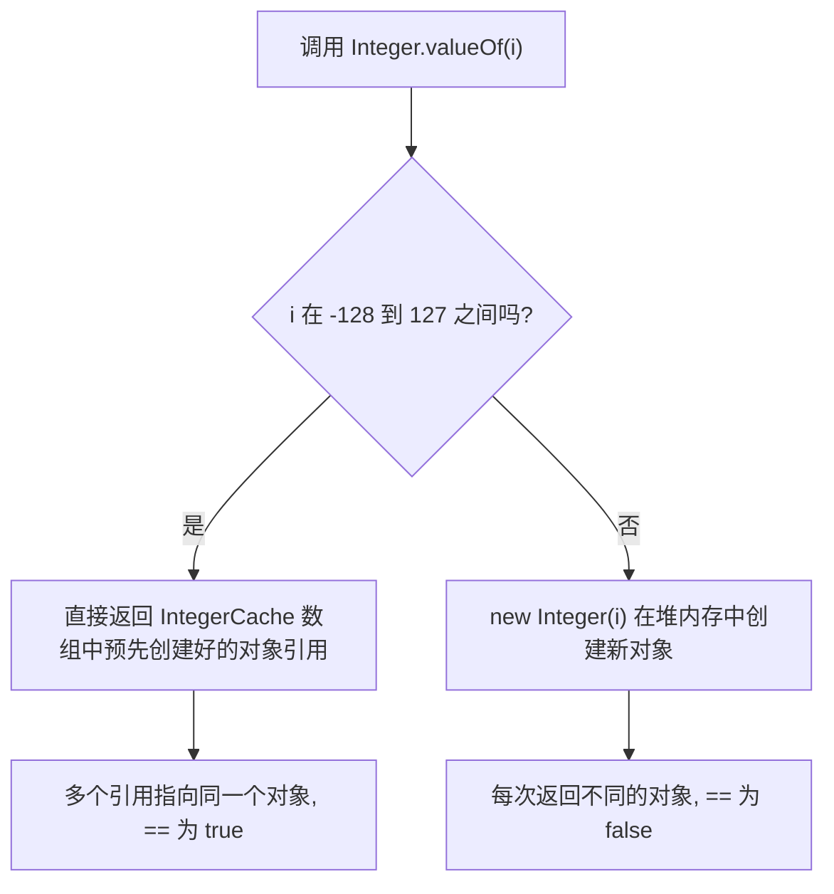
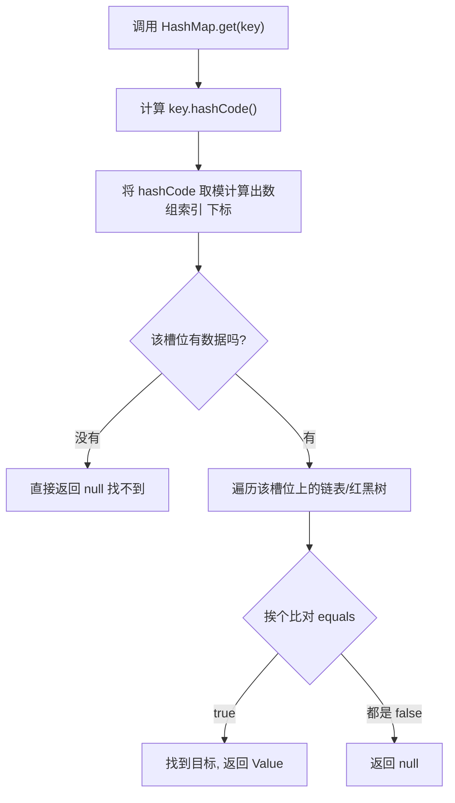
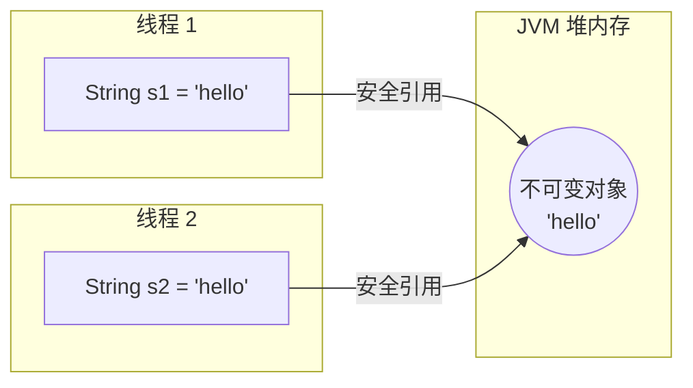
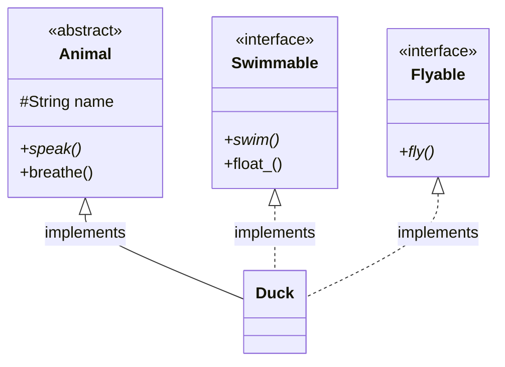
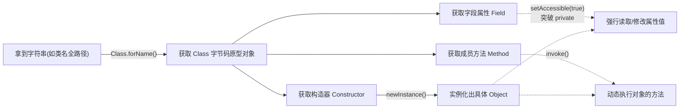
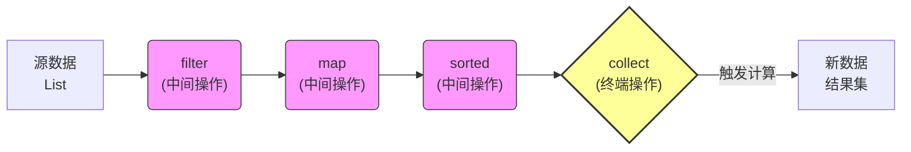
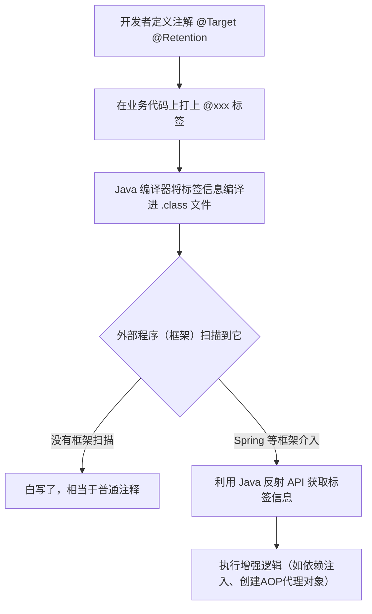

# 05 - Java 基础

> 覆盖 Java 语言核心基础：数据类型、字符串、面向对象、关键字、异常处理、反射与泛型等高频面试考点。

---

## 一、数据类型与基础语法

### 1. Java 有哪些基本数据类型？

> ⭐⭐⭐ 常问 | 难度：⭐

**回答**：Java 有 **8 种基本数据类型（primitive types）**，分为 4 类：整型、浮点型、字符型和布尔型。简单说，这 8 种类型就像是不同大小的"储物盒"。你要装针线就拿小号盒（byte），装衣服拿中号盒（int），装被子拿大号盒（long）。Java 是强类型语言，强制要求一开始就定好不同大小的类型，既不浪费内存，也不会溢出。

| 类型 | 关键字 | 字节数 | 默认值 | 取值范围 |
|------|--------|--------|--------|----------|
| 整型 | `byte` | ⚡**1** | 0 | -128 ~ 127 |
| 整型 | `short` | ⚡**2** | 0 | -32768 ~ 32767 |
| 整型 | `int` | ⚡**4** | 0 | -2^31 ~ 2^31-1 |
| 整型 | `long` | ⚡**8** | 0L | -2^63 ~ 2^63-1 |
| 浮点型 | `float` | ⚡**4** | 0.0f | IEEE 754 单精度 |
| 浮点型 | `double` | ⚡**8** | 0.0d | IEEE 754 双精度 |
| 字符型 | `char` | ⚡**2** | '\u0000' | 0 ~ 65535 |
| 布尔型 | `boolean` | **不确定** | false | true / false |

> 注意：`boolean` 在 JVM 规范中没有明确规定字节数，HotSpot 实现中单独使用时占 ⚡**4 字节**（当作 int 处理），在 boolean 数组中占 ⚡**1 字节**。

---

### 2. 自动装箱与拆箱是什么？有什么陷阱？

> ⭐⭐⭐⭐ 高频 | 难度：⭐⭐⭐

**一句话回答**：自动装箱是基本类型自动转为包装类型，拆箱是反过来。陷阱在于包装类的对象缓存池机制和可能引发的 NPE（空指针异常）。

**通俗理解**：

想象你有一堆散装的散钱硬币（基本类型），你要把它们寄快递发给外地的朋友，但快递公司规定不能发散装硬币，必须装进特定的官方存钱罐盒子（包装类型）里才能发出去。Java 5 之后，编译器就像一个贴心的"快递小哥"，你给他散装硬币，他自动帮你找个盒子装好发走；朋友收到盒子，他又自动帮你把硬币倒出来。这就是 **自动装箱（Auto-boxing）** 和 **自动拆箱（Auto-unboxing）**。

但这里有个"坑"——为了省钱省力，快递站点提前做好了一批装了 1 毛到 1 块钱的"常用面值盒子"放在仓库里复用。如果你的硬币刚好是这个面值，小哥就直接去仓库拿那个现成的盒子（缓存）；如果你的面值很大（比如几百块），仓库里没有，小哥就只能当场给你专门定做一个全新的专属盒子（new 新对象）。

**回到技术**：
1. **"散装硬币"与"盒子"**：硬币就是 `int`、`double` 等基本数据类型，它们没有对象特征；盒子就是 `Integer`、`Double` 等包装类对象，可以调用方法、存入集合。
2. **"快递小哥自动打包/拆包"**：这就是编译器的语法糖。写代码时你直接用基本类型赋值给包装类，编译时编译器会自动插入 `Integer.valueOf()` 和 `intValue()` 方法调用，不用你手动写。
3. **"仓库里的常用面值盒子"**：这就是包装类的**缓存池机制**。比如 Integer 内部有一个静态数组（缓存池），提前存了 -128 到 127 的 Integer 对象。
4. **"专门定做专属盒子"**：当数值超出缓存范围时，编译器会直接 `new Integer(值)` 创建一个全新的在堆内存中的对象。了解这点很重要，因为它直接决定了你用 `==` 比较时的结果。

**原理详解**：

**【底层为什么这样设计？】**
Java 是面向对象的，集合（如 `List<Integer>`）只能存对象，不能存基本类型 `int`。但基本类型运算快、占内存小。为了在"面向对象的便利性"和"基本类型的高性能"之间找平衡，Java 设计了包装类，并通过编译器提供自动装箱/拆箱的语法糖，减轻程序员负担。缓存池则是为了减少频繁 new 小数值对象带来的内存浪费和 GC 压力。

装箱本质调用 `Integer.valueOf()`，拆箱本质调用 `intValue()`。

**Integer 缓存池**：`Integer.valueOf()` 对 ⚡**-128 ~ 127** 范围内的值会返回缓存池中的对象引用，超出范围则 `new` 一个新对象。



```java
Integer a = 127;  // 自动装箱：编译器转为 Integer.valueOf(127) 
Integer b = 127;
// 命中缓存，a 和 b 指向缓存池里的同一个对象
System.out.println(a == b);  // true 

Integer c = 128;  // 超出缓存范围
Integer d = 128;
// 没命中缓存，各自 new 了一个新对象，内存地址不同！
System.out.println(c == d);  // false 

Integer e = null;
// 自动拆箱：编译器转为 e.intValue()
// 因为 e 是 null，null.intValue() 报错！
int f = e;  // throw NullPointerException 
```

**各包装类型的缓存范围**：

| 包装类型 | 缓存范围 |
|----------|----------|
| `Byte` | ⚡**-128 ~ 127**（全部） |
| `Short` | ⚡**-128 ~ 127** |
| `Integer` | ⚡**-128 ~ 127**（可通过 JVM 参数调整上限） |
| `Long` | ⚡**-128 ~ 127** |
| `Character` | ⚡**0 ~ 127** |
| `Boolean` | `TRUE` / `FALSE`（两个实例） |
| `Float` / `Double` | **无缓存** |

**🎤 面试这样答**：
> "自动装箱就是编译器自动调用 `valueOf()` 把基本类型转成包装类，拆箱就是调用 `xxxValue()` 转回来。主要陷阱有两个：一是 `==` 比较时，Integer 在 -128 到 127 范围内会复用缓存对象，超出范围就是不同对象，所以包装类比较必须用 `equals()`；二是包装类型可能为 null，拆箱时会抛 NPE。"

---

### 3. == 和 equals() 的区别？

> ⭐⭐⭐⭐⭐ 必考 | 难度：⭐⭐

**一句话回答**：`==` 比较的是内存地址（基本类型直接比值），`equals()` 比较的是对象的内容（前提是类重写了该方法）。

**通俗理解**：

想象你和朋友各买了一瓶标着"001号"生产批次的同款可乐。`==` 问的是："你俩手里拿的是不是**物理上的同一瓶**可乐？"（比地址），而 `equals()` 问的是："你俩的可乐**味道是不是一模一样**？"（比内容）。

如果你俩各自拿着自己的瓶子，那 `==` 的结果是 false（不是同一瓶），但 `equals()` 的结果是 true（味道一样）。如果基本类型（比如直接给你两块钱）没有"瓶子"的概念，那就直接比数字大小（直接比味道）。

**回到技术**：
1. **"瓶子本身物理位置"**：这就是对象在 JVM 堆内存中的首地址，`==` 对引用类型比较的就是这个十六进制的地址数字。
2. **"两个瓶子不同"**：当你用 `new` 关键字创建对象时，JVM 会在堆里开辟两块独立的内存，虽然内容一样，但因为在堆里的位置不同，各自的地址数字不同，所以 `==` 肯定是 false。
3. **"可乐的味道"**：这就是对象的成员变量内容（比如字符串的字符数组）。`equals()` 可以深入到对象内部去挨个对比这些字符是否一样。
4. **"直接比数字"**：对于基本类型（int、double），它们本身不是对象，变量里直接存的就是数值本身，所以用 `==` 直接比较数值大小即可。

**原理详解**：

**【底层为什么这样设计？】**
为什么 `==` 对引用类型比的是地址？因为在 JVM 的栈帧中，局部变量表里存储的"对象引用"（变量名），其实就是一串指向堆中对象实际位置的指针（地址值）。执行 `==` 时，CPU 只是在做最简单的数字对比——对比栈里这两个指针的数值是否相等。如果要比对象内容，代价很大（要跨内存去堆里扒出数据一一比对），所以交给了专门的方法 `equals()` 去做。

**① 基本类型**：`==` 直接比较值
```java
int a = 10;
int b = 10;
System.out.println(a == b);  // true —— 数值相等
```

**② 引用类型**：`==` 比较内存地址，`equals()` 比较内容
```java
String s1 = new String("hello");
String s2 = new String("hello");

// 内存布局示意图：
// [栈 Stack]      [堆 Heap]
//  s1 (0x1122) ---> "hello" (地址 0x1122)
//  s2 (0x3344) ---> "hello" (地址 0x3344)

System.out.println(s1 == s2);      // false —— 0x1122 != 0x3344，地址不同
System.out.println(s1.equals(s2)); // true  —— 挨个字符比对，都是'h','e','l','l','o'，内容相同
```

**③ Object 的 equals() 默认实现就是 `==`**：
```java
// Object.java 源码
public boolean equals(Object obj) {
    return (this == obj);  // 默认也是比地址！
}
```
所以自定义类如果不重写 `equals()`，效果和 `==` 完全一样。必须像 `String`、`Integer` 那样手动重写它，才能实现"比内容"。

**🎤 面试这样答**：
> "对于基本类型，`==` 比较的是数值大小。对于引用类型，`==` 比较的是它们在栈中存放的堆内存地址（即是否是同一个对象）。而 `equals()` 是 Object 类的方法，默认实现也是用 `==` 比地址。但像 String、Integer 这些内置类都重写了 `equals()`，改为比较对象内部的值。所以日常比较对象内容时，一定要用重写后的 `equals()`。"

---

### 4. hashCode() 和 equals() 是什么关系？为什么重写 equals 必须重写 hashCode？

> ⭐⭐⭐⭐⭐ 必考 | 难度：⭐⭐⭐

**一句话回答**：`equals()` 相等的两个对象，`hashCode()` 必须相等；反过来不一定。重写 equals 不重写 hashCode 会导致对象无法正确存取于 HashMap 等哈希集合中。

**通俗理解**：

把 HashMap 想象成一个有很多格子的**巨型快递驿站**。你寄快递时，驿站先根据你的**手机尾号**（hashCode）决定把你的包裹放到哪个货架的袜子里，比如尾号 001 的都放 A 架。等你来取快递时，驿站也先按照尾号 001 直接走到 A 架，缩小寻找范围；然后在 A 架的一堆包裹中，挨个核对**身份证和姓名**（equals），完全一致才把包裹交给你。

如果两个人名字身份证一样（equals 相等），但偏偏填了不同的手机尾号（hashCode 不同），那取快递时驿站就会去跑到另一个货架上找，根本找不到你的包裹，导致丢件。

**回到技术**：
1. **"巨型快递驿站"**：这就是基于哈希表实现的集合，比如 HashMap、HashSet。它们的作用就是为了极其快速地存取数据。
2. **"手机尾号与货架号"**：你的手机尾号就是对象的 `hashCode()` 返回的整数，驿站用它对数组长度取模算出的"货架号"，就是 HashMap 中底层数组的槽位（Bucket）索引。这个步骤是为了快速定位，时间复杂度 O(1)。
3. **"核对身份证和姓名"**：这就是调用 `equals()` 方法。因为同一个槽位（同一个手机尾号）里可能存了多个不同的对象（哈希冲突），所以找到槽位后，还需要用 `equals()` 挨个彻底验证 key 是否真的是同一个。
4. **"名字一样但尾号不同导致丢件"**：如果你只重写了 `equals()` 没重写 `hashCode()`，就算两个对象逻辑上一样，但它们的哈希值不同，HashMap 就会把它们放进不同的槽位。导致 `put` 进去的值永远 `get` 不出来。

**原理详解**：

**【底层为什么这样设计？】**
为什么不直接遍历所有元素只用 `equals()` 找？因为慢！如果 HashMap 有 100 万个元素，每次 get 都要调用 100 万次 `equals()`，性能极差。哈希算法的核心思想就是**空间换时间**，用 `hashCode()` 算出位置，直接干掉 99.9% 的冗余比较，剩下的极少数（在同一个坑里的）再用 `equals()` 慢条斯理地确认，大幅提升效率。

**HashMap 查询流程图**：


**Java 规范的三条强制约定**：
1. `equals()` 返回 `true` → `hashCode()` **必须相等**
2. `equals()` 返回 `false` → `hashCode()` **可以相等**（哈希冲突，比如 "Aa" 和 "BB" 的 hash 值都是 2112）
3. `hashCode()` 相等 → `equals()` **不一定** `true`

**反面教材**——只重写 equals 不重写 hashCode：
```java
public class User {
    private String name;

    // 只重写了 equals，业务上认为名字一样就是同一个人
    @Override
    public boolean equals(Object o) {
        if (this == o) return true;
        if (o == null || getClass() != o.getClass()) return false;
        return Objects.equals(name, ((User) o).name);
    }
    // 💣 致命错误：没有重写 hashCode！使用的是 Object 默认的内存地址哈希
}

Map<User, String> map = new HashMap<>();
User u1 = new User("张三");
map.put(u1, "开发人员");

User u2 = new User("张三");
// 两人确实是 equals 的
System.out.println(u1.equals(u2));  // true

// 但因为没重写 hashCode，u2 的哈希值和 u1 不同，去错槽位了！
System.out.println(map.get(u2));    // null！引发严重 Bug
```

**正确写法**——用相同的字段双重写：
```java
@Override
public int hashCode() {
    return Objects.hash(name);  // 确保 Equals 用的字段和 HashCode 用的字段绝对一致
}
```

**🎤 面试这样答**：
> "Java 规范规定，如果两个对象 equals 相等，它们的 hashCode 必须也相等。这是由于 HashMap 等底层是哈希表的集合所决定的。HashMap 会先通过 hashCode 快速定位数组槽位，再用 equals 比较链表上的 key 来确认目标。如果只重写 equals 不重写 hashCode，两个逻辑相同的对象会有不同的哈希值，会被 HashMap 当成不同的 key 放到错误的槽位里，导致 get 方法取不到之前 put 的值。因此它们必须成对并且使用相同的字段进行重写。"

---

## 二、字符串

### 5. String、StringBuilder、StringBuffer 的区别？

> ⭐⭐⭐⭐⭐ 必考 | 难度：⭐⭐

**一句话回答**：String 内部是定长数组不可变，拼接会产生大量对象；StringBuilder 内部是动态数组可变且性能最高，但线程不安全；StringBuffer 方法加了 synchronized 锁，线程安全但性能较差。

**通俗理解**：

把在 Java 里处理字符串想象成**车间里组装产品**：
- **String** 就像是用**石头雕刻**。师傅在石头上刻了一个"A"，如果老板说要在后面加个"B"，对不起石头不能改。师傅只能重新找一块更大的新石头，在上面重新刻上"AB"，原来的旧石头就当垃圾扔了。
- **StringBuilder** 就像是用**乐高积木拼装**。你给了一块底板放上"A"，老板说加个"B"，你直接在底板后面咔嚓拼起"B"就行了。如果底板不够长，换个大底板把之前的挪过去即可，完全是一个师傅（单线程）在极速操作。
- **StringBuffer** 也是**用乐高拼装**，但车间里同时有几个师傅（多线程）在抢着拼这一个作品。为了不打架，车间主任规定：谁拿到"唯一的一把老虎钳"（锁）谁才能拼，其他人排队等。虽然不会拼乱，但排队导致速度很慢。

**回到技术**：
1. **"石头雕刻不能改"**：这就是 String 不可变的核心原理。它的内部实际是用一个 `final` 修饰的底层数组存放字符，一旦创建，长度和内容就锁死了。每次用 `+` 拼接，JVM 都会在堆里 `new` 出一个全新的 String 对象。
2. **"乐高积木直接追加"**：StringBuilder/StringBuffer 内部是一个普通的、没有被 `final` 修饰的数组。调用 `append()` 方法时，代码是直接在原数组的末尾填入新字符，所以速度极快且不产生垃圾对象。
3. **"换个大底板挪过去"**：如果 StringBuilder 自带的底层数组装满了（默认容量 16），它就会触发**扩容机制**（拉跨底层数组容量，通常是旧容量的 2 倍 + 2），把老数据 `System.arraycopy` 拷贝过去。
4. **"一把老虎钳控制排队"**：StringBuffer 的几乎所有公共方法（如 `append`、`insert`）都加上了 `synchronized` 关键字。多线程环境下必须先获取对象锁，保证了线程安全，但牺牲了效率。

**原理详解**：

**【底层为什么这样设计？】**
为什么有了 StringBuilder 还要有效率低的 StringBuffer？因为在早期 Java 版本中缺乏成熟的并发包，StringBuffer 作为首个可变字符类，保守地选择了线程安全。直到 JDK 1.5，官方才加入了去除 `synchronized` 锁的 StringBuilder，以在单线程场景下释放极致性能。

| 特性 | String | StringBuilder | StringBuffer |
|------|--------|---------------|--------------|
| 内部结构 | ⚡**`final char[]` / `final byte[]`** | `char[]` / `byte[]`（可扩容） | `char[]` / `byte[]`（可扩容） |
| 变化性 | ⚡**不可变** | 可变 | 可变 |
| 线程安全 | 安全（不可修改自然安全） | ⚡**不安全**（无锁操作） | ⚡**安全**（`synchronized` 锁） |
| 拼接性能 | 极低（大量 new 对象） | **极高**（直接查表赋值） | 较低（有加解锁开销） |

> 注意：JDK 9 之后，这三者的底层数组统一从 `char[]` 改为 `byte[]` + `coder` 标志位（**Compact Strings** 优化）。因为日常开发中绝大多数都是英文字母（1字节），改用 byte[] 存可以省下一半内存。

**拼接字符串时的内存创建对比示意图**：
```text
【String s += "!" 过程】                【StringBuilder.append("!") 过程】
1. 创建对象 "A"                        1. 创建对象 [ 空白数组, 容量16 ]
2. 创建对象 "!"                        2. 在数组槽位 [0] 填入 'A'
3. 新建对象 "A!" (废弃"A"和"!")         3. 在数组槽位 [1] 填入 '!'
(循环1万次，堆里就会产生1万个垃圾废物)   (循环1万次，仅仅是底层数组扩容了几次)
```

**性能对比代码示例**：
```java
// ❌ 反面教材：在循环中直接使用 String 拼接
String s = "";
for (int i = 0; i < 10000; i++) {
    s += i;  // 致命错误：这行编译后等价于 s = new StringBuilder(s).append(i).toString();
             // 每次循环都会毫无意义地 new 两个对象（StringBuilder 和 String）！
}

// ✅ 正确做法：在循环外申明 StringBuilder，循环内利用同一个对象 append
StringBuilder sb = new StringBuilder();
for (int i = 0; i < 10000; i++) {
    sb.append(i);  // 极速操作：只在同一个底板数组上操作，0 垃圾产生
}
String result = sb.toString();
```

**🎤 面试这样答**：
> "由于 String 是不可变的，内部是 final 数组，每次拼接都会产生新的对象，性能极差。此时应该用可变的 StringBuilder 或 StringBuffer。两者的底层原理都是可自动扩容的动态数组。区别在于 StringBuffer 的方法加了 synchronized 锁，是线程安全的，但在单线程下性能较差。目前绝大多数场景都是单线程拼接，所以首推性能最高的 StringBuilder。需要提醒的是，虽然编译器会把代码中的加号优化成 StringBuilder，但如果是在 for 循环内部用加号，每次循环都会重复新建对象，所以循环中必须手动显式声明 StringBuilder。"

---

### 6. String 为什么设计成不可变的？

> ⭐⭐⭐⭐ 高频 | 难度：⭐⭐⭐

**一句话回答**：为了安全（防止参数被篡改）、性能（实现字符串常量池复用）和线程安全（不可变对象天生线程安全）。

**通俗理解**：

String 就像是国家发行的**人民币面额钞票**——印好了是多少钱，就是多少钱，谁都不能涂改。如果有个人手里拿了一张 10 块钱，他觉得不够花，偷偷用笔在上面加了个 0 变成了 100 块。那你手里、超市老板收银台里同样批次印出来的那张 10 块钱，岂不是也跟着变成了 100 块？这整个经济系统不就崩溃了吗！

所以，国家（设计者）规定：面额钞票（String）绝对不能改。如果你想要 100 块，不要在 10 块上面改，去银行（JVM）重新取一张 100 块的钞票（新对象）就行了。

**回到技术**：
1. **"印好的钞票绝不能改"**：这就是 String 的不可变性。String 类被 `final` 修饰不能被继承（断绝子类作弊），内部存数据的字符数组也被 `private final` 修饰，而且绝对不提供任何可以修改数组内容的 setter 方法。
2. **"一张钞票多个人同时持有"**：这正是 Java 的**字符串常量池**机制。在堆内存里，只有一个 "10块"（"hello"）的对象，但可以有无数个变量引用（你、我、超市老板）同时指向它，以极大地节省内存。
3. **"一个人改了所有人跟着遭殃"**：如果 String 是可变的，某段代码擅自把 "hello" 改成了 "world"，那么程序里所有用到 "hello" 的地方全乱套了。
4. **"想要 100 块去重新取一张"**：这就是为什么你每次对 String 做 `+=`、`replace` 等操作，它都会乖乖地在堆里新 new 出一个带有新结果的 String 对象，而永远不会去改原来那个对象。

**原理详解**：

**【底层为什么这样设计？】**
Java 之父 James Gosling 曾解释过，除了常量池复用省内存外，其实很多时候是为了**安全考量**。<br>
想象一下，你写了个转账功能，用 String 传了卡号。如果 String 是可变的（比如像 StringBuilder 一样），别人在另外一个线程里恶意或者不小心调了下 `append()` 把卡号改了，钱就转给别人了。不可变对象就像一个天然的保护罩，在多线程环境完全不需要加锁，传给任何方法都不用担心被偷偷修改。

**① 实现层面的"三重门"保护**：
```java
// String.java 源码（JDK 8）
public final class String {           // 第一重：类用 final 修饰，不准继承重写方法
    private final char value[];       // 第二重：数组引用用 final 修饰，不准换地址
    // 第三重：数组用 private 修饰，且不提供任何如 setValue() 的方法，不准改内容
}
```

**② 字符串常量池引发的连带效应**：


| 原因 | 核心说明 |
|------|------|
| **字符串常量池** | 相同内容的字符串永远共享同一个对象，极大节省内存。<br>如果可变，一个变量修改了内容，其他引用的变量全受影响。 |
| **hashCode 缓存** | String 的 `hashCode()` 是基于内容计算的并会被缓存下来。不可变保证了哈希值永远绝对不变，所以 String 非常适合做 HashMap 的 key。 |
| **线程安全** | 不可变对象天然线程安全，多线程共享传参完全无需同步加锁。 |
| **安全性** | 网络连接 URL、文件路径、数据库账号密码全是 String，<br>如果可变，极容易在使用前被恶意反射或异步线程篡改。 |

**🎤 面试这样答**：
> "String 设计成不可变主要有三个核心原因。首先，为了支持字符串常量池。Java 中大量使用字符串，如果内容一样就复用同一个对象，极大提升了内存效率；但如果它是可变的，常量池里共享同一个引用的所有变量都会引发连锁反应出 Bug。其次是安全性，因为网络路径、文件路径都是 String，不可变防止了被恶意篡改，并且它是天然线程安全的。最后是为了缓存 hashCode，不可变确保了它极其适合作为 HashMap 的 Key。在实现上，String 类用 final 修饰防止继承，内部由 private final 的字符数组存放数据，且不提供任何修改方法。"

---

### 7. String 的 intern() 方法有什么作用？

> ⭐⭐⭐ 常问 | 难度：⭐⭐⭐

**回答**：`intern()` 方法的作用是手动将字符串放入**字符串常量池（String Pool）**，如果池中已有相同内容的字符串，则直接返回池中对象的引用。通俗地说，常量池就像"官方认证公用词典"，你自己 new 的对象是"草稿纸"，调用 `intern()` 就是向词典申请收录。如果有现成的官方版就直接用，能极大节省内存。

**原理详解**：

**【底层有什么变化？】**
- JDK 6：常量池在 **永久代（PermGen）**。调用 `intern()` 时，如果池里没有，JVM 会把你堆里的字符串对象**复制**一份完整的放在永久代池子里。
- JDK 7+：由于永久代内存太小容易 OOM，字面量常量池被移到了 **堆（Heap）** 中。此时再调用 `intern()`，如果池中没有，JVM 不再费力搬运，而是在池中**记录堆里原对象的引用地址**。

**【代码演示】**
```java
String s1 = new String("hello");  // "hello"在类加载时进入常量池，同时又在堆中 new 了一个新对象，s1 指向堆对象
String s2 = s1.intern();          // 去常量池找"hello"，发现已经有官方版了，直接返回官方版的引用
String s3 = "hello";              // 直接拿字面量，也是指向常量池里的官方版

System.out.println(s1 == s2);  // false —— s1 是堆中平民对象，s2 是常量池官方版
System.out.println(s2 == s3);  // true  —— 大家指向的都是常量池的同一个对象
```

**经典面试题**：`String s = new String("hello")` 创建了几个对象？

答：最多 ⚡**2 个**。编译期分析到字面量 `"hello"` 时，会在常量池创建一个对象（前提是池里原来没有）；运行期执行 `new` 操作时，会在堆内又创建一个平民 String 对象，并把它里面的字符数据指向常量池里的数组。所以如果你只是查数据，千万别没事去 `new String`。

---

## 三、面向对象

### 8. 接口和抽象类的区别？

> ⭐⭐⭐⭐⭐ 必考 | 难度：⭐⭐

**一句话回答**：抽象类本质是同一类事物的"公共骨架"（is-a），支持单继承和代码复用；接口本质是跨类的"行为契约"（can-do），支持多实现和解耦。

**通俗理解**：

把面向对象编程想象成**开公司招人**：
- **抽象类**就像是一份**《程序员岗位说明书》**（is-a，你是程序员）。上面写了公司给你配的工位和电脑（成员变量），规定了一些所有程序员都有的带薪休假制度（具体逻辑），同时留了几个空白的格子叫"编写业务代码"（抽象方法），要求具体入职的前端或后端自己去填怎么写。但一个人只能签一份全职劳动合同（单继承）。
- **接口**就像是一张**《英语六级证书》**（can-do，你能说英语）。它不管你有没有工位，也不管你是程序员、销售还是行政，它只规定了一条极其冷酷的红线：你必须"能流利对话"（抽象方法）。一个人可以同时拥有英语证书、PMP 证书、驾照等无数个证书（多实现）。

**回到技术**：
1. **"岗位说明书"与单继承**：抽象类主要用于自下而上的抽取公共代码，子类必须 `extends` 它。作为类的亲爹，Java 规定只能单继承，所以抽象类里既可以有普通变量，也能写具体的方法实现供子类直接复用。
2. **"技能证书"与多实现**：接口主要用于自上而下的指定行为规范，类必须 `implements` 它。正因为它只是一纸契约（默认全都是抽象方法），不带具体实现不占资源，所以对象可以拥有无数个接口的多实现，从而把不同类的对象连在一个通道里调用。

**原理详解**：

**【底层深度追问：为什么 Java 类只能单继承，而接口可以多实现？】**
这是因为著名的**菱形继承问题（Diamond Problem）**。如果 Java 允许类多重继承，假设类 B 和类 C 都继承了类 A，并且都重写了 A 的 `eat()` 方法，此时如果类 D 同时继承了 B 和 C，当 D 调用 `eat()` 时，JVM 就懵了：到底该调 B 的还是 C 的？
而接口默认全是抽象方法（没有具体实现代码），就算多实现，最终的具体逻辑也是由 D 自己重写决定的，压根不会出现冲突的灾难，所以接口支持多实现完全没有包袱。

**类图结构对比示意图**：


| 对比项 | 抽象类（abstract class） | 接口（interface） |
|--------|--------------------------|-------------------|
| 核心设计理念 | ⚡**is-a**（抽取公共血脉代码） | ⚡**can-do / has-a**（跨越血脉定义行为契约） |
| 继承/实现 | 单继承（`extends`） | **多实现**（`implements`） |
| 成员变量 | 可以有各种普通的私有/公共变量 | 只能有 `public static final` 全局常量 |
| 构造方法 | **有**（供子类 super 调用初始化） | 无 |
| 方法 | 可以有抽象方法，也可以有具体逻辑 | JDK 8 前只能有抽象方法 |
| JDK 8+ 新增 | — | 可以有 `default` 具体方法和 `static` 方法 |
| JDK 9+ 新增 | — | 可以有 `private` 方法（供 default 复用） |

**代码演示**：
```java
// 抽象类："骨架代码"，单继承
public abstract class Animal {
    protected String name;          // 可以有状态（成员变量）
    public Animal(String name) {    // 可以有构造方法
        this.name = name;
    }
    public abstract void speak();   // 抽象方法给子类实现
    public void breathe() {         // 具体方法直接复用
        System.out.println("呼吸");
    }
}

// 接口："附加契约"，多实现
public interface Swimmable {
    void swim();                    // 抽象方法（默认 public abstract）
    default void float_() {         // JDK 8 默认方法，不强迫所有实现类修改代码
        System.out.println("漂浮");
    }
}

// 对象既是血脉继承，又签订了多个能力契约
public class Duck extends Animal implements Swimmable, Flyable {
    public Duck(String name) { super(name); }
    @Override public void speak() { System.out.println("嘎嘎"); }
    @Override public void swim() { System.out.println("鸭子游泳"); }
    // float_() 不强制重写，breathe() 直接继承
}
```

**🎤 面试这样答**：
> "抽象类和接口的核心区别在于设计理念：抽象类是 is-a 关系，用于抽取亲属类的公共骨架代码，由于 Java 是单继承，所以只能继承一个抽象类；接口则是 can-do 关系，用于跨族类定义行为契约，支持多实现来解耦。
> 在语法上，抽象类可以有普通成员变量、构造方法以及完整的方法实现；而传统的接口只能有全局静态常量和抽象方法。不过为了方便扩展，JDK 8 给接口引入了 default 默认方法和 static 方法，JDK 9 甚至加入了 private 方法，让接口变得越来越像抽象类，但接口依然不支持状态（无法定义普通变量）和多继承本质未变。"

---

### 9. 重载（Overload）和重写（Override）的区别？

> ⭐⭐⭐⭐ 高频 | 难度：⭐⭐

**一句话回答**：重载是同一个类中"方法名相同、参数不同"，属于编译期绑定的静态多态；重写是子类覆盖父类的"同名同参方法"，属于运行期绑定的动态多态。

**通俗理解**：

- **重载（Overload）**就像是肯德基里的**"全家桶套餐"**。虽然在菜单上它们都叫"全家桶"（方法名相同），但只要你跟服务员报的参数不同——比如你说"要 3 人份的"或者"要带可乐的"（参数个数或类型不同），服务员立刻就知道你要的是哪一款具体套餐。
- **重写（Override）**就像是**"子承父业的祖传秘方"**。老爹在饭店菜单上写了一道"麻婆豆腐"（父类方法），儿子接手饭店后，觉得老爹的做法不符合现代人口味，于是自己在厨房里用全新的配方重新做了一道"麻婆豆腐"（子类覆盖父类）。菜名、介绍（参数列表）完全没变，但客人吃进去的味道（内部实现）已经是儿子改良版的了。

**回到技术**：
1. **"报不同的参数上不同的套餐"**：这是**方法重载**。它发生在一个类内部。编译器在编译代码时，只要看到你传入的参数类型和个数，就能精确地把方法调用**静态绑定**到对应的实现上，这也被称为编译时多态。
2. **"菜名叫麻婆豆腐，实际吃的是儿子版"**：这是**方法重写**。它发生在父子类之间。当你用父类引用指向子类对象（如 `Animal a = new Dog();`）并调用方法时，编译器不知道具体执行哪个。只有在程序真正跑起来时，JVM 根据实际 `new` 出来的具体对象类型，**动态绑定**到子类的代码上，这就是面向对象三大核心特性之"多态"的底层支撑。

**原理详解**：

**【底层原理解析：静态分派与动态分派】**
重载的本质是**静态分派**。在 Java 代码编译（`javac`）阶段，编译器会严格根据你传入的实际参数的"静态类型"（声明它的类型）和个数，决定究竟调用哪一个重载版本，并把调用的目标方法符号引用直接写死进 `.class` 字节码中。
而重写的本质是**动态分派**。编译期只知道调用了父类的方法，到了运行期（`java`），JVM 执行 `invokevirtual` 指令时，会顺着对象的引用扒开堆内存，找到它**真正的"实际类型"实例**，然后去该实例的方法表（Method Table）里寻找有没有重写过的方法，如果有就执行真正的子类方法。

**【底层绑定机制对比图】**
```text
【重载 Overload：静态绑定】                 【重写 Override：动态绑定】
编译期（敲代码时）能定死：                  编译期只看左边声明，运行期看右边实例：
                                            Animal a = new Dog();
calc.add(1, 2) --> add(int, int)            a.speak() 
                                                |
calc.add(1.0, 2.0) --> add(double, double)      |-- 编译期以为执行 Animal.speak()
                                                |-- 运行期发现真正肚子里装的是 Dog
                                                    最终 JVM 动态分派执行 Dog.speak()
```

| 对比项 | 重载（Overload） | 重写（Override） |
|--------|------------------|------------------|
| 发生位置 | **同一个类**中 | **子类与父类**之间 |
| 方法名 | 相同 | 相同 |
| 参数列表 | ⚡**必须不同**（类型/个数/顺序） | ⚡**必须相同** |
| 返回值 | 无要求 | 相同或是其子类（协变返回） |
| 访问修饰符 | 无要求 | ⚡**不能更严格**（子类 ≥ 父类） |
| 异常 | 无要求 | ⚡**不能抛更大的受检异常** |
| 绑定时机 | **编译期**（静态分派） | **运行期**（动态分派，多态） |

```java
// 重载：同一个类，方法名相同，参数不同
public class Calculator {
    public int add(int a, int b) { return a + b; }
    public double add(double a, double b) { return a + b; }  // 参数类型不同
    public int add(int a, int b, int c) { return a + b + c; } // 参数个数不同
}

// 重写：子类覆盖父类方法
public class Animal {
    public void speak() { System.out.println("..."); }
}
public class Dog extends Animal {
    @Override  // 建议加上注解，编译器会帮你检查
    public void speak() { System.out.println("汪汪！"); }
}
```

**🎤 面试这样答**：
> "重载发生在同一个类中，方法名相同但参数列表不同，在编译期就确定调用哪个方法。重写发生在子类和父类之间，方法签名完全相同，在运行期根据对象的实际类型动态分派，这是多态的基础。重写时要注意：访问权限不能更严格，不能抛出更大的受检异常，返回值要相同或是协变类型。"

---

### 10. 深拷贝与浅拷贝的区别？

> ⭐⭐⭐⭐ 高频 | 难度：⭐⭐⭐

**一句话回答**：浅拷贝只复制对象外壳和基本类型字段，引用类型字段仍共享同一个内存地址；深拷贝会把对象内部引用的其他对象也一并克隆，实现内存上的完全独立。

**通俗理解**：

想象你有一份**纸质求职简历**，上面用胶水贴了一张**你的近照**：
- **浅拷贝**就像是你拿这份简历去**复印机复印**了一份。复印件上，文字信息（基本类型）都印过来了，但照片那个位置只是印了个"请看原版照片"的备注（引用地址）。如果你突发奇想拿油号笔在原版照片上给自己画了两撇胡子，面试官看原版或是看复印件时，都会看到那个长胡子的你，因为两份简历共用了**同一张物理照片**。
- **深拷贝**就像是你不仅复印了文字，还跑去照相馆**重新冲洗了一张全新的照片**贴在第二份简历上。这下两份简历完全独立了，哪怕你把第一份照片撕了，也丝毫不管第二份的事。

**回到技术**：
1. **"纸质求职简历"**：这就是内存中的源对象（比如 `Person` 类含有 `age` 和 `Address` 参数）。
2. **"文字信息复印"**：浅拷贝对于基本数据类型（如 `int age`），会直接在内存里拷贝数值（类似复印文字），互不影响。
3. **"画了胡子两边都受影响"**：这是因为浅拷贝对于引用类型（如 `Address`），仅仅拷贝了代表内存地址的十六进制数字（类似"请看原版照片"的备注）。这就导致新老对象的 `Address` 字段指向了 JVM 堆里的同一块内存。你改了源地址，拷贝件自然跟着变。
4. **"重新冲洗全新照片"**：深拷贝在拷贝完基本类型后，会顺藤摸瓜，把原对象内部引用的 `Address` 对象在堆内存里也彻彻底底 `new` 出一份全新的拷贝。二者的内存地址切割开来，实现物理层面的完全隔离。

**原理详解**：

**【底层为什么默认是浅拷贝？】**
Java 的 `Object.clone()` 方法默认提供的是浅拷贝。为什么不默认给深拷贝？因为性能。如果要深拷贝一个对象，JVM 需要分析它引用了多少个其他对象，甚至还要处理复杂的引用链（比如 A 引用 B，B 引用 C，C 又引用 A 引发死循环）。出于性能和安全考量，JDK 把深拷贝的权利下放给开发者，让你自己根据业务按需实现。

**浅/深拷贝的内存布局示意图**：
```text
【浅拷贝内存示例】                       【深拷贝内存示例】

栈        堆                            栈        堆
p1 ---> [ Person@01 ]                   p1 ---> [ Person@01 ]
        - int age: 18                           - int age: 18
        - Address addr --+                      - Address addr --+
                          \                                       \
p2 ---> [ Person@02 ]      |            p2 ---> [ Person@02 ]      |
        - int age: 18      V                    - int age: 18      V
        - Address addr ---> [ Address@99 ]      - Address addr ---> [ Address@99 ]
                                                ( 深拷贝在堆里把内部对象也完全复制一份！ )
( p1 和 p2 指向独立的 Person 外壳对象,          [ Address@88 ] <---+
  但它们的内部通过引用共享了同一个 Address )                    
```

**代码演示与实现方式**：
```java
public class Person implements Cloneable {
    int age;
    Address address;   // 引用类型

    // 浅拷贝：直接调用超类 Object.clone()，仅仅复制皮囊和地址
    @Override
    protected Person clone() throws CloneNotSupportedException {
        return (Person) super.clone();
    }

    // 深拷贝：手动层层递归调用
    protected Person deepClone() throws CloneNotSupportedException {
        Person copy = (Person) super.clone();
        // 🚨 核心：必须手动调用内部引用属性的 clone 并且重新赋值绑定！
        copy.address = (Address) this.address.clone();  
        return copy;
    }
}
```

深拷贝除了重写 `clone()`，还有两种常见方案：
1. **JSON 反序列化**：用 Fastjson/Jackson 把对象转成 JSON 字符串，再解析回新对象。开发最省事，但性能最差（反射/串流开销大）。
2. **实现 Serializable**：通过对象输出流写入内存 `ByteArrayOutputStream`，再用输入流读出来。比 JSON 稍快，但也比较慢。

**🎤 面试这样答**：
> "浅拷贝是默认的拷贝行为，它只克隆对象的外壳和基本类型字段，对于引用类型的字段，只会复制它的内存地址。这导致新旧对象实际上共享着同一个内部引用，修改一方会影响另一方。而深拷贝不仅复制外壳，还会顺藤摸瓜把内部所有的引用对象统统在堆内存里重新创建一份，实现了物理上的完全隔离。
> 实现深拷贝通常有三种做法：一是通过层层重写 clone 方法递归拷贝，性能最好但代码繁琐且容易漏；二是用对象序列化机制写出再读入；三是直接借助 JSON 工具类进行转码互转。在业务开发中，如果对性能没极致要求，推荐用 JSON 序列化最省心。"

---

## 四、关键字与修饰符

### 11. final 关键字的作用？

> ⭐⭐⭐⭐ 高频 | 难度：⭐⭐⭐

**一句话回答**：`final` 表示"不可改变的"。修饰类不能被继承，修饰方法不能被重写，修饰变量不能被重新赋值。在并发编程中它还能保证对象的安全发布。

**通俗理解**：

`final` 就像是皇帝下达的**圣旨（盖棺定论）**，一旦颁布，任何人不得篡改：
- **final 类** 就像是被皇帝**"满门抄斩，绝后了"**。这个类没有任何子嗣可以继承它的家产。
- **final 方法** 就像是家族的**"祖传秘方"**。后代虽然可以继承家业，但绝对不准私自修改这个秘方的配料表。
- **final 变量** 就像是**"刻在三生石上的名字"**。一旦刻上去（初始化赋值），就再也无法抹去换成别人的名字。

**回到技术**：
1. **"绝后"的 final 类**：如果你设计了一个极度底层、涉及安全的核心类（比如 `String` 或 `Math`），你不希望任何人通过继承（`extends`）来重写里面的逻辑搞破坏，那就加上 `final`。
2. **"不准改配方"的 final 方法**：父类中提供了一个通用且完美的方法，子类可以调用，但父类强硬规定子类绝对不能 `Override` 改变它的核心逻辑。
3. **"名字刻在石头上"的 final 变量**：变量一旦被 `final` 修饰并在构造器中赋了值，它的引用地址就彻底死锁了，不能再重新 `=` 给别人。但如果是引用类型，**地址锁死了，里面装的东西还是能换的**。

**原理详解**：

**【并发编程中的大招：final 的内存语义】**
很多人以为 `final` 只是禁止修改，其实在 Java 并发编程（JMM）中，`final` 有一个极其重要的作用：**保证安全发布（重排序规则）**。
在多线程下，如果一个对象没有被完全初始化好，它的引用就被另一个线程拿到了，那个线程可能会看到对象里的属性还是个半成品（由于 CPU 指令重排）。但如果属性被 `final` 修饰，JVM 强制规定：**在构造函数结束前，所有 final 字段必须初始化完毕，并且把结果同步到主内存**。这就确保了其他线程只要能拿到这个对象，就一定能看到 `final` 属性的正确值，不会读到半成品。这也是为什么 String 等不可变对象天生线程安全的原因。

**【final 防止逸出的内存屏障示意图】**
```text
普通字段：                            final 字段：
线程A：new Object()                  线程A：new Object()
      |写入 x=10                           |写入 final y=20
      | (还未同步到主内存)                 | [插入 StoreStore 内存屏障]  <-- 核心!
      V                                    |强制立刻同步到主内存
   (对象地址被逸出拿到)                    V
线程B：读取 obj.x = 0 (半成品Bug！)      线程B：拿到对象时，obj.y 绝对已经是 20 了
```

**代码演示**：
```java
// ① final 修饰类：断子绝孙
public final class String { }  
// public class MyString extends String { }  // ❌ 编译直接报错

// ② final 修饰方法：不准子类重写
public class Parent {
    public final void doSomething() { }
}
public class Child extends Parent {
    // public void doSomething() { }  // ❌ 编译直接报错
}

// ③ final 修饰变量：地址锁死，但内容可变
public class Test {
    public static void main(String[] args) {
        final int x = 10;
        // x = 20;  // ❌ 编译报错，基本类型数值不可变
        
        // ⚠️ 经典陷阱：final 数组或集合
        final List<String> list = new ArrayList<>();
        list.add("hello");  // ✅ 绝对可以！往容器里塞东西，并没有改变 list 变量本身指向的地址
        
        // list = new LinkedList<>();  // ❌ 报错！企图把 list 变量重新指向一个新地址，不行！
    }
}
```

**🎤 面试这样答**：
> "final 的基本用法有三种：修饰类表示不能被继承（如 String），修饰方法表示不能被子类重写，修饰变量表示不可被重新赋值。对于引用类型的变量，final 只保证它指向的内存地址不变，但引用的对象内部状态依然是可以修改的。
> 另外在高级特性上，final 在 Java 内存模型中能防止指令重排序，保证了『可见性』和『安全发布』。构造函数里对 final 变量的写入会在构造完成前加入内存屏障，确保只要对象构造完成，别的线程读到的 final 字段绝对是初始化后的正确值，这也是不可变对象线程安全的底层支撑。"

---

### 12. static 关键字有哪些用法？

> ⭐⭐⭐ 常问 | 难度：⭐⭐

**回答**：`static` 表示"静态的、类级别的"。它修饰的成员属于整个类，而不是某个具体的对象实例。通俗地说，普通实例变量就像是每个学生的"私人水杯"得自己端着，而 `static` 变量就像是班级角落的"公共饮水机"，不属于特定学生，哪怕班里还没招到学生，饮水机也已经摆在那里供全班共享。

**代码与原理分析**：

| 用法 | 说明 | 面试关键点 |
|------|------|------------|
| **静态变量** | 类级别共享，所有实例共用一份 | 用 `类名.变量名` 访问。修改后对所有对象立竿见影 |
| **静态方法** | 不依赖实例，直接用 `类名.方法名()` 调用 | 内部不能访问 `this`，也不能直接调用非静态成员 |
| **静态代码块** | 类加载时自动执行，且只执行一次 | 常用于初始化静态资源，如加载配置文件、驱动等 |
| **静态内部类** | 属于类的内部类，不持有外部类的引用 | 创建实例时不需要先有外部类对象，有效防止内存泄漏 |
| **静态导入** | `import static` | 可以省去类名修饰直接调用方法（如 `Math.abs` -> `abs`） |

```java
public class Counter {
    private static int count = 0;  // 静态变量：所有实例共享

    static {  // 静态代码块：类加载时执行一次
        System.out.println("类被加载了");
    }

    public static int getCount() {  // 静态方法
        // this.xxx  // ❌ 静态方法中不能用 this
        return count;
    }

    static class Inner {  // 静态内部类：不持有外部类引用
        // ...
    }
}
```

**执行顺序**：父类静态代码块 → 子类静态代码块 → 父类构造代码块 → 父类构造方法 → 子类构造代码块 → 子类构造方法。

---

## 五、异常处理

### 13. Java 异常体系是怎样的？

> ⭐⭐⭐⭐⭐ 必考 | 难度：⭐⭐⭐

**一句话回答**：Java 异常的根类是 `Throwable`，它分为 `Error`（系统级灾难，程序无法处理）和 `Exception`（程序级异常）。`Exception` 下又分为**受检异常**（编译期强制要求处理）和**非受检异常**（运行时异常，通常是代码 Bug）。

**通俗理解**：

把程序运行想象成**一家航空公司运营航班**：
- **Error** 就像是突然爆发了**超级地震或火山喷发**。这种属于不可抗力的天灾，航空公司（代码）根本无力回天，不需要也不可能提前制定应急预案去强行让航班起飞（不应该 catch）。
- **受检异常（Checked Exception）** 就像是预见到了前方的**暴雨或雷暴天气**。这种属于极其常见的外部客观风险，航空局（编译器）强制要求你起飞前必须有预案：要么绕飞（`try-catch` 自己吞掉处理），要么直接向上级空管局报告无法起飞（`throws` 抛给上层），如果没有预案，飞机一动都不能动（编译报错）。
- **非受检异常（RuntimeException）** 就像是机长**起飞前忘了检查油表**或者空姐**没关好舱门**。这纯粹是航空公司内部的人员失职（代码 Bug），这种事不应该靠"一旦没关好舱门我们该怎么补救"这种预案来解决，而应该在起飞前就把乘务员开除换个靠谱的（修改代码逻辑，提前做非空/越界判断），所以航空局不强制你写预案（不强制 catch）。

**回到技术**：
1. **"天地灾变"的 Error**：比如 `OutOfMemoryError`（内存溢出）或 `StackOverflowError`（栈溢出）。这是 JVM 层面的严重故障，程序就算捕获了也没办法恢复，只能让他挂掉。
2. **"雷暴天气"的 Checked Exception**：比如你读写一个文件，文件可能真的在硬盘上不存在（`FileNotFoundException`），或者网络突然断了（`IOException`）。这是程序正常运行中合理的外部失败，设计者认为必须强迫程序员做异常恢复逻辑，否则代码不健壮。
3. **"忘关舱门"的 RuntimeException**：比如传了个空指针（`NullPointerException`）或者数组越界（`IndexOutOfBoundsException`）。这是你自己的代码没写好，理应在写代码时用 `if(obj != null)` 规避，而不是事后去 `catch` 它。

**原理详解**：

**【底层设计理念：为什么要分受检和非受检？】**
Java 之父 James Gosling 引入受检异常的原意是"强迫开发者处理可恢复的异常，写出更健壮的代码"。但现在，Spring 等现代框架几乎把所有异常都封装成了非受检异常（如 `DataAccessException`）。为什么？因为在现代多层 Web 架构中，底层 Dao 抛了个受检异常，Service 层就算强迫捕获了也不知道怎么处理，只能全靠 `throws` 一层层往外抛给全局异常处理器，徒增大量模板代码，反而破坏了开闭原则。所以现在的共识是：尽量少用自定义受检异常。

**异常体系架构树**：
```text
                     Throwable (能被 throws 和 catch 的老祖宗)
                    /         \
    (不该捕获的天灾) Error        Exception (应该处理的异常)
               /    \        /         \
      OutOfMemory  StackOverflow   RuntimeException    IOException (受检异常)
                                   /        \          /        \
                           NullPointer  ClassCast  FileNotFound  EOFException
                           IndexOutOf   IllegalArg
```

| 分类 | 说明 | 编译器态度 | 常见例子 | 面试关键点 |
|------|------|-------------|----------|----------|
| **Error** | JVM 系统级错误 | 不管，不强迫处理 | `OOM`、`StackOverflow` | 绝对不要去 catch Error 去试图掩盖问题 |
| **受检异常** | 外部环境预期会发生的异常 | ⚡**必须** `catch` 或 `throws` 声明，否则编译不报错 | `IOException`、`SQLException` | 反射里的 `ClassNotFoundException` 也是受检的 |
| **非受检异常** | `RuntimeException` 及其子类，通常是代码 bug | 不管，不强迫处理 | `NPE`、`IndexOutOfBounds` | 应该通过代码逻辑（如 if 判断）提前规避，而不是 catch |

**try-catch-finally 执行顺序的坑**：

```java
public static int test() {
    try {
        return 1;
    } finally {
        return 2;  // ⚠️ finally 中的 return 会覆盖 try 中的 return！
    }
}
// 结果返回 2，不是 1！
```

**🎤 面试这样答**：
> "Java 异常体系的根类是 Throwable，分为 Error 和 Exception。Error 是 JVM 层面的严重错误，比如 OOM，程序不应该 catch。Exception 分为受检异常和非受检异常：受检异常编译器强制要求处理，比如 IOException；非受检异常是 RuntimeException 的子类，比如 NPE，通常是代码 bug，应该通过逻辑判断避免而不是 catch。实际开发中推荐用 try-with-resources 处理资源关闭，避免在 finally 中写 return。"

---

### 14. throw 和 throws 的区别？

> ⭐⭐ 了解 | 难度：⭐

**回答**：`throw` 是动作，在方法内部真实地抛出一个异常对象；`throws` 是声明，在方法签名上告诉调用者"我这可能会出事"。通俗理解：`throws` 就像是游乐场过山车入口处挂的"风险警示牌"，提醒游客可能有危险需要自己做好准备；而 `throw` 就像是运行中突然被按下的"红色急停按钮"，是一个实实在在立刻中断程序的动作指令。

**使用场景与代码示例**：

```java
// throws：写在方法签名上，声明可能抛出的异常类型（可以有多个），推给别人处理
public void readFile(String path) throws IOException, IllegalArgumentException {
    if (path == null) {
        // throw：写在方法体内部，伴随着 new，实实在在地造出一个异常对象并砸出去
        throw new IllegalArgumentException("路径不能为空！");  
    }
    // ...
}
```

| 对比项 | throw | throws |
|--------|-------|--------|
| **词性与动作** | 动词（抛出实体） | 名词/声明（抛出可能性） |
| **位置** | 方法**体内** | 方法**签名上**（参数列表后） |
| **后面跟什么**| 异常**对象（实例）** | 异常**类型（类名）** |
| **数量限制** | 一次只能抛出**一个**具体对象 | 可以声明**多个**类型（逗号分隔） |
| **影响范围** | 执行到这句，方法必定强行终止 | 只是声明，方法内部不一定会真的出异常 |

---

## 六、高级特性

### 15. 反射机制是什么？有什么应用场景？

> ⭐⭐⭐⭐⭐ 必考 | 难度：⭐⭐⭐

**一句话回答**：反射（Reflection）是指在程序**运行期间**，能够动态获取任何一个类的信息（字段、方法、构造函数等），并且能够动态操作这些对象的机制。它是所有 Java 主流框架（Spring、MyBatis 等）的底层基石。

**通俗理解**：

正常写代码（先 `new` 对象再调方法）就像是**拿着菜单去餐厅点菜**：
- 菜单上明明白白写着有什么菜（编译期已经确定的类），你点什么厨师就做什么。你绝对不可能点菜单上没有的菜，因为服务员（编译器）会当场拒绝你（编译报错）。
- **反射**则像是你**强行踹爆了餐厅后厨的门，自己冲进去当大厨**。此时你手里根本没有菜单，但你可以翻箱倒柜把后厨所有的储物柜打开（获取 `Class` 对象），看看里面到底都囤了啥菜叶子和调料（获取 `Field` 字段），不仅能看到厨师们私下自己才吃的家常菜（突破 `private` 限制），你甚至还可以根据找到的材料，临时起意随手捞起一个锅自己炒一盘菜（动态执行 `Method.invoke()`）。

**回到技术**：
1. **"拿着菜单点菜"**：这是我们日常写的**正向代码**，如 `User u = new User(); u.setName("A");`。所有的类型和方法在敲代码的时刻（编译期）就已经在内存里定死了。
2. **"踹开后厨的门翻柜子"**：这就是**反射**。在代码真正跑起来的时候（运行期），程序通过类的全限定名（如 `Class.forName("com.User")`）摸到了 JVM 内存里的类原型。
3. **"发现私房菜并自己炒菜"**：通过这个类原型，程序可以使用 `getDeclaredFields()` 和 `getDeclaredMethods()` 扒出这个类所有的底细，甚至使用 `setAccessible(true)` 打破了面向对象引以为傲的封装性（能够操控 `private` 变量），并动态执行它们。

**原理详解**：

**【底层为什么需要反射？框架为什么离不开它？】**
设想一下，如果你是设计 Spring 框架的人，你的代码必须要能在全世界几百万个项目的环境里跑。但是你在写 Spring 源码的时候，**你根本不知道未来使用 Spring 的程序员会写出什么名字的类！** 你怎么帮他们实例化对象？你怎么帮他们做依赖注入？
有了反射，Spring 就不需要提前知道类名了。程序员只要在 XML 或注解里配置一句 `@Component("myUserService")`，Spring 在运行时读到这个字符串，用 `Class.forName()` 动态把它加载进内存，然后反射拿到它的构造函数帮它 `new` 出来，反射拿到它带有 `@Autowired` 的字段强行塞入依赖。这就是反射最重要的意义：**写出极其通用、与业务完全解耦的动态代码**。

**反射操作流程示意图**：


**获取 Class 对象的三种方式**：
```java
// 1. 类名.class（多用于编译期确定的参数传递）
Class<?> clazz1 = String.class;

// 2. 对象.getClass()（必须先有对象实例）
String s = "hello";
Class<?> clazz2 = s.getClass();

// 3. Class.forName()（最牛逼，最灵活，全靠一个字符串，框架最爱）
Class<?> clazz3 = Class.forName("java.lang.String");
```

**🎤 面试这样答**：
> "反射的核心意义在于动态性。普通的正向编程是在编译期就定死类型，而反射允许程序在运行期间动态地获取类的各种信息，并能操作其实例。获取 Class 原型通常有三种方式：类名.class、对象.getClass() 和 Class.forName()。
> Spring IoC、AOP 后端框架几乎全靠反射支撑。比如 IoC 容器就是通过解析配置或注解拿到全限定类名字符串，再通过 Class.forName 加载并反射调用构造函数创建 Bean，用反射 Field 突破 private 限制完成依赖注入。反射虽然极其强大灵活，但它的缺点是会破坏类的封装性，并且因为绕过了多数编译期检查并涉及动态解析，执行性能会比普通的直接调用差很多。"

---

### 16. 泛型是什么？什么是类型擦除？

> ⭐⭐⭐⭐ 高频 | 难度：⭐⭐⭐

**一句话回答**：泛型是 Java 提供的一种"参数化类型"机制，能在编译期进行严格的类型安全检查。但 Java 泛型是"伪泛型"，在编译成字节码时所有的泛型参数都会被替换为真正的普通类型（类型擦除），在运行期并不保留泛型信息。

**通俗理解**：

把泛型想象成是**安检站和快递纸箱**的组合：
- **引入泛型**像是你在发快递时，向寄件安检员（编译器）申请了一个**"只能装书的专用纸箱"**（`List<Book>`）。
- **编译期检查**就是安检员在你往纸箱里放东西时，会死死盯着你。如果你胆敢往里塞了一件"衣服"（`list.add(new Clothes())`），安检员立刻拦住你报错，这就避免了以前什么乱七八糟都能往里塞（`List<Object>`）导致收件人拆盲盒报错的尴尬。
- **类型擦除**则是这个箱子在通过安检、打包扔进卡车（运行时 JVM 内存）的那一瞬间，箱子上"只能装书"的**标签被彻底撕掉了**。此时它在货车里就是一个平平无奇的普通纸箱（原生态的 `List`），货车司机根本不知道里面装的是书还是杯子。

**回到技术**：
1. **"申请专用纸箱和安检员检查"**：这是开发者在写代码时声明的泛型：`List<String> list = new ArrayList<>()`。有了这个声明，当你在 IDE（编译器）里写下 `list.add(123)` 时，IDE 会立刻飘红报错，这就是泛型带来的编译期静态类型检查安全。
2. **"标签被撕掉变回普通纸箱"**：这就是**类型擦除（Type Erasure）**。Java 源码在被 `javac` 编译成 `.class` 字节码文件时，`List<String>` 或 `List<Integer>` 都会被无情地扒光外衣，统一擦除退化成最原始的 `List` 类型。

**原理详解**：

**【底层有什么猫腻？为什么要设计类型擦除？】**
这是个极度无奈的妥协。Java 直到 JDK 5 才引入泛型，但当时全世界已经有无数的旧系统在跑着用原生态 `List` 写的代码。如果 Java 像 C# 那样实现真泛型（在运行时也区分 `List<String>` 和 `List<Integer>`），就会导致 JDK 5 编译出来的代码无法和 JDK 1.4 的旧代码兼容运行。为了兑现"向后兼容"的死磕承诺，Java 之父们只好采用了"语法糖"策略——**泛型只给编译器看，运行时全扔掉**，假装啥也没发生。

**类型擦除的编译前后对比图**：
```text
【你写的 Java 源码】                          【编译器悄悄转换后的 .class 字节码】

List<String> list = new ArrayList<>();   ==>   List list = new ArrayList();
list.add("hello");                       ==>   list.add("hello");
                                                
// 你不用写强转,编译器帮你写了                  // 取出时,编译器自动插入了一抹强转代码!
String s = list.get(0);                  ==>   String s = (String) list.get(0);

----------------------------------------------------------------------------------
【泛型类的内部擦除逻辑】

class Node<T> {                          ==>   class Node {
    T data;                              ==>       Object data;  (无边界T退化为Object)
}                                        ==>   }

class Node<T extends Number> {           ==>   class Node {
    T data;                              ==>       Number data;  (有边界的T退化为该特定父类)
}                                        ==>   }
```

**类型擦除带来的无语限制**：
既然运行时的内存里根本没有泛型这回事，那以下操作统统不行：
1. **不能 `new` 泛型对象/数组**：`T obj = new T()` 或 `T[] arr = new T[10]` 都是错的。因为 JVM 运行到这行时不知道 T 到底是个啥，没法分配具体内存。
2. **不能用 `instanceof` 判断泛型**：`if(obj instanceof List<String>)` 会报错。因为运行时它们全都是 `List.class`。
3. **奇怪的重载冲突**：同一个类里写 `void do(List<String> list)` 和 `void do(List<Integer> list)`，正常思路这是两个方法，但在 Java 里编译直接报错：类型擦除后它俩的方法签名一模一样！

**🎤 面试这样答**：
> "Java 泛型本质上是为了提供编译期的类型安全检查，以及省去我们人工强转的硬编码。但在底层实现上，Java 采用的是由于历史遗留问题妥协而来的『类型擦除』机制，也就是所谓的伪泛型。
> 在编译过程中，所有泛型参数 T 在字节码中都会被擦除替换掉。如果没有限定边界，就被替换成 Object；如果用 extends 限定了上界，就替换成该类型。由于运行时完全丢失了泛型的明确类型，所以我们不能实例化泛型 T，不能 new 泛型数组，也不能用 instanceof 来做泛型的精确类型判断。但是，类和方法签名上声明的泛型信息依然会以 Signature 的形式保留在类的常量池中，我们可以通过反射获取到。"

---

### 17. 序列化与反序列化是什么？为什么要序列化？

> ⭐⭐⭐ 常问 | 难度：⭐⭐

**回答**：**序列化（Serialization）** 是把对象的状态转换为字节流以便存储或传输；**反序列化（Deserialization）** 是把字节流还原回 Java 对象。通俗地说，对象是内存里立体复杂的"拼接版乐高玩具车"，不能直接扯一根网线发出去。要想跨越网络传输或存进硬盘，必须把它彻底拆碎成一维的零件袋（序列化成字节流），对方收到后再按图纸重新原样拼装回来（反序列化）。

**代码演示与原理**：

Java 原生的实现方式很简单：让类实现 `Serializable` 接口（这是一个标记接口，里面一个方法都没有，纯粹是为了打个"允许序列化"的标签给 JVM 看）。

```java
public class User implements Serializable {
    // 强烈建议手动写死版本号！反序列化时靠这个核对暗号
    private static final long serialVersionUID = 1L;  
    
    private String name;
    
    // transient 修饰的隐秘信息（如密码、身份证号）绝对不会被装袋序列化
    private transient String password;  
    
    // static 修饰的是班级公用物品，不属于某个特定学生对象，当然也不参与序列化
    private static int totalUsers; 
}
```

**关键面试点**：

| 要点 | 说明 |
|------|------|
| `serialVersionUID` | **版本暗号**。如果前后两次版本号不一致（比如你加了个新字段但没固定该 ID 值导致 JVM 自动生成了新 ID），反序列化解袋时就会抛出 `InvalidClassException` 崩溃。所以强烈建议显式定死为 1L。 |
| `transient` 关键字 | 贴上这个标签的字段，就像是隐私物品，**绝对不会被装进袋子序列化（忽略该字段）**，恢复出来此字段默认为 null/0。常用于密码、银行卡号等敏感及临时缓存信息。 |
| `static` 字段 | **属于类，不属于对象**，自然也不参与基于对象的序列化。 |
| 替代方案 | Java 原生序列化不仅码流庞大且存在安全漏洞（漏洞之王）。现代微服务中，大家都在用 **JSON（Jackson/Gson）** 或 **Protobuf/Hessian** 来互转，性能和跨语言能力吊打原生。 |

---

### 18. Object 类有哪些常用方法？

> ⭐⭐⭐ 常问 | 难度：⭐⭐

**回答**：`Object` 是 Java 里所有类的"老祖宗"（根类）。它定义了 9 个基础方法，凡是对象天生都自带这些功能。通俗地说，既然大家都是由同一个共同祖先繁衍而来，基因里就必定留下了最通用的"本能"：比如能向外界描述我是谁（`toString`）、能跟别人比高低（`equals`）、能繁衍后代（`clone`），还能在家族大院里互相打招呼排队（`wait/notify`）。

**核心方法详解**：

| 分类 | 方法 | 作用与面试踩坑点 |
|------|------|------------|
| **特征提取** | `getClass()` | 返回对象的运行时全局唯一 Class 原型，是**反射的入口**。声明为 `final` 不可重写。 |
| **内容比较** | `equals(Object obj)` | 默认比较内存地址（等同于 `==`）。业务中通常会覆盖重写，改为比较内部属性字段是否相同。 |
| **散列摘要** | `hashCode()` | 返回对象的哈希码（主要供 HashMap 等容器计算槽位索引使用）。⚡**强烈注意：重写 equals 必须连带重写 hashCode！** |
| **字符串输出** | `toString()` | 默认输出 `类全名@十六进制哈希码`。日常开发建议用 IDEA 自动生成重写，方便打印日志看报文。 |
| | | |
| **繁衍机制** | `clone()` | 创建并返回当前对象的一份拷贝。默认是**浅拷贝**，调用类必须实现 `Cloneable` 接口否则抛异常。 |
| **多线程通信**| `wait(..)` | 让当前持锁线程让出 CPU 和锁，进入等待状态，直到被唤醒或打断。⚡**必须包裹在 synchronized 中使用**。 |
| **多线程通信**| `notify() / notifyAll()` | 唤醒在此对象监视器上等待的单个/所有线程。同样必须在 `synchronized` 内使用。 |
| | | |
| **垃圾回收** | `finalize()` | 濒死体验：对象被垃圾收集器回收前会被调用一次。⚡**JDK 9 已标记 @Deprecated 弃用**，千万别在业务逻辑里用它释放资源，极其不靠谱。 |

```java
public class User {
    private String name;
    private int age;

    @Override
    public boolean equals(Object o) {
        if (this == o) return true;
        if (o == null || getClass() != o.getClass()) return false;
        User user = (User) o;
        return age == user.age && Objects.equals(name, user.name);
    }

    @Override
    public int hashCode() {
        return Objects.hash(name, age);
    }

    @Override
    public String toString() {
        return "User{name='" + name + "', age=" + age + "}";
    }
}

---

### 19. Java 8 有哪些重要的新特性？

> ⭐⭐⭐⭐⭐ 必考 | 难度：⭐⭐⭐

**一句话回答**：Java 8 是一次里程碑式的升级，核心思想是**函数式编程**。最重要的三大护法是：**Lambda 表达式**（简化匿名内部类）、**Stream API**（流式处理集合）和 **Optional**（优雅防范空指针）。

**通俗理解**：

Java 8 以前写代码就像是**写八股文公文**，Java 8 之后就像是**发微信说大白话**。
- **写公文**：你想让手下去买杯咖啡，你必须先写个请示报告，写明时间地点人物，盖个公章，流程极其繁琐且废话连篇。
- **发微信**：现在你直接发条微信给手下："去买杯美式"。只保留最核心的动作指令，其他啰嗦的格式全砍掉。
- **流水线车间**：以前你要洗菜、切菜、炒菜，必须自己拿着同一个篮子在三个车间跑来跑去。现在你把菜扔进传送带，旁边站着各种处理工，最后自动装盘，你不需要管这中间是怎么搬运循环的，只需要发号施令即可。
- **快递防爆箱**：以前收快递第一件事就是防备里面装的是炸弹。现在所有高风险快递强行装在一个防爆箱里，系统提供了一套安全开箱的方法，强迫你安全合规地取货。

**回到技术**：
1. **"发微信指令"**：这就是 **Lambda 表达式**和函数式接口，它砍掉了匿名内部类冗长的 `new` 接口及方法签名等硬编码结构，变成了极致轻量级的代码块参数传递。
2. **"传送带处理"**：这就是 **Stream API**。它用极其优雅的声明式链流（`filter`, `map`），取代了传统极易出错的嵌套 `for` 循环和 `if` 判断。
3. **"防爆箱拆解"**：这就是 **Optional**。它强制把可能为 null 的实体装载在一个具有 API 保障能力的容器内，彻底根治了满篇狗皮膏药般的 `if (obj != null)` 检测逻辑。

**核心特性详解**：

**① 核心基础：函数式接口 (Functional Interface)**
Lambda 表达式不能凭空存在，它的载体必须是**函数式接口**（包含且仅包含一条抽象方法的接口，常被 `@FunctionalInterface` 标记）。

| 内置通用接口 | 抽象方法签名 | 作用大白话 |
|-----------|------|------|
| `Supplier<T>` | `T get()` | **纯生产者**：啥也不吃，就给你吐出一个对象 |
| `Consumer<T>` | `void accept(T)` | **无底洞消费者**：吃掉你给的对象，啥也不吐 |
| `Predicate<T>` | `boolean test(T)` | **质检员**：吃进去一个对象，告诉你合不合格（布尔值） |
| `Function<T,R>` | `R apply(T)` | **加工厂**：吃进去一个苹果，加工后吐出一瓶果汁 |

**② 效率大杀器：Lambda 与 Stream 的结合**

```java
// 需求：从所有用户中筛选出年龄 > 25 岁的，提取出他们的名字，按首字母排序，取前 5 个
List<User> users = getUsers();

// 【老古董写法】：啰嗦且容易出错
List<String> names = new ArrayList<>();
for (User u : users) {
    if (u != null && u.getAge() > 25) {  // 满地都是 null 判断
        names.add(u.getName());
    }
}
Collections.sort(names);  // 还要单独拿出来自己排
if (names.size() > 5) {
    names = names.subList(0, 5);
}

// 【Java 8 流水线写法】：一气呵成，天下武功唯快不破
List<String> java8Names = users.stream()         // 1. 开动传送带
    .filter(u -> u.getAge() > 25)                // 2. 质检员：过滤出 >25 岁的
    .map(User::getName)                          // 3. 加工厂：把 User 对象映射(榨)成 String 名字
    .sorted()                                    // 4. 洗牌：给名字基于默认字典序排序
    .limit(5)                                    // 5. 闸门：只要前 5 个人
    .collect(Collectors.toList());               // 6. 装箱：收集成 List
```

**【Stream 流水线执行原理示意图】**


> **面试暗坑**：Stream 是**惰性求值**的！中间的 `filter`/`map` 写得再花哨，如果没有最后一步的 `collect` 或 `forEach`（终端操作），传送带压根就不会启动，前面的代码根本不会执行！且一个 Stream 对象**只能被消费一次**。

**③ 优雅防范 NPE：Optional**

```java
// 丑陋的老代码
String city = "未知";
if (user != null && user.getAddress() != null && user.getAddress().getCity() != null) {
    city = user.getAddress().getCity();
}

// 优雅的 Optional 链式提取
String city = Optional.ofNullable(user)
    .map(User::getAddress)
    .map(Address::getCity)
    .orElse("未知"); // 如果上面任何一步抽空中了 null，都会平滑过渡到这个默认值
```
> **面试暗坑**：千万别拿 Optional 替换实体类的属性字段（它没有实现序列化接口，会导致极大的麻烦），也极度不推荐作为方法参数传入。它被造出来的初衷就是**作为高风险可能为 null 的方法返回值**。

**🎤 面试这样答**：
> "Java 8 最大的颠覆是引入了函数式编程思想。日常开发用得最多的就是利用 Lambda 表达式简化冗余代码，利用 Stream API 提供的高效声明式流水线彻底告别让人头晕眼花的嵌套 for 循环。配合四大核心内置函数式接口（Supplier/Consumer/Predicate/Function），代码语义极其清晰。另外，用 Optional 包装可能为 null 的实体，通过其 map 和 orElse 方法做链式调用，也是目前业界根治 NullPointerException 嵌套判空最优雅的手段。除此之外，Java 8 还在接口里加入了默认方法（default）和静态方法，使得接口演进具备了更好的向前兼容性。"

---

## 七、容易混淆的核心机制

### 20. Java 到底是值传递还是引用传递？

> ⭐⭐⭐⭐⭐ 必考 | 难度：⭐⭐⭐⭐

**一句话回答**：Java **只有值传递，没有引用传递**。对于基本数据类型，传递的是数据值本身的拷贝；对于引用数据类型，传递的是对象在堆中的**内存地址（引用的值）的拷贝**。

**通俗理解**：

把传递参数想象成**你把家里的钥匙分享给朋友**：
- **基本数据类型传递（值传递）** 就像是你朋友想要你家里的一个苹果。你**重新去超市买了一个一模一样的苹果**递给他。他拿回家不管怎么啃、怎么切，都绝对不会影响你家里果盘上的那个苹果。
- **引用数据类型传递（依然是值传递！）** 就像是你朋友借你家的除草机。你总不可能把整座房子（对象副本）搬给他，于是你**去门口配钥匙摊，花 5 块钱配了一把一模一样的备用钥匙**（拷贝了内存地址），然后把这把拷贝的钥匙交给了他。
    - **情况 1（修改内部状态）**：他拿着刚配的钥匙打开了你家的门，把家里的沙发放倒了（修改对象的属性 `obj.setName()`）。等你用原配钥匙回家一看，沙发确实被放倒了。
    - **情况 2（重新指向新对象）**：他嫌你家太破，拿着这把配来的钥匙，把钥匙上的标签撕掉，重新贴上了另一栋大别墅的名字（在方法内重新 `obj = new Object()`）。这时候这把拷贝的备用钥匙就跟你家完全解绑了，他拿钥匙开的是别人家的门。你拿着原配钥匙回家，家里一切照旧，毫无影响。

**回到技术**：
Java 没有 C++ 里的"引用传递（用 `&` 取真地址）"概念。Java 在把实参传给方法里的形参时，永远发生的是**拷贝动作**！
只不过，当参数是 `int` 这类基本类型时，直接拷贝 `100` 这个数值；当参数是 `Object` 等引用类型时，传的参数实际是"这个对象在堆里的首地址（比如 `0x9928`）"，Java 会把 `0x9928` 这串数字拷贝一份给形参。
正因如此，通过形参能摸到原对象并修改属性，但一旦对形参重新 `new` 赋值，形参的地址值就变了，而外层实参的地址值依然纹丝不动。

**原理详解**：

**【底层设计考量：为什么 Java 坚决抛弃了真实的引用传递？】**
在 C++ 中，你可以通过引用传递直接操纵外部指针的指向，这极其强大但也极其危险——一个写得不好的函数可以轻松摧毁整个内存安全防线。Java 设计之初的核心目标就是"安全"和"简单"。通过强制纯值传递，Java 在底层切断了方法内部胡乱修改外部指针的途径；虽然这稍微带来了一点点传参性能损耗（每次都要拷贝一次地址字面量），但换来了坚如磐石的内存安全性，同时也将垃圾收集器（GC）从复杂的指针纠葛中解放出来。

**【底层证明图解：内存里的指针到底是怎么走的】**

```java
public static void main(String[] args) {
    int num = 10;
    User user = new User("张三");
    
    // 调用方法
    change(num, user);
    
    System.out.println(num);         // 依然是 10
    System.out.println(user.name);   // 变成了 "李四" (属性被内部修改)
}

public static void change(int n, User u) {
    n = 20;               // 纯粹修改拷贝的值
    u.name = "李四";      // 顺着拷贝的钥匙进屋修改了属性
    u = new User("王五"); // 拷贝的钥匙改换门庭，彻底抛弃了原来的家
}
```

**内存地址快照分析**：
```text
【方法调用前的内存状态（栈）】
main方法栈帧: 
 [ num   ] = 10
 [ user  ] = 0xAA (指向堆里的 张三 对象)
---------------------------------------------------------
【进入 change 方法的那一刻（发生拷贝！）】
change方法栈帧: 
 [ n     ] = 10   (从 num 拷贝而来)
 [ u     ] = 0xAA (从 user 拷贝而来，也指向同一个 张三)
---------------------------------------------------------
【执行完 change 内部代码后的状态】
main方法栈帧: 
 [ num   ] = 10   (完全没动过)
 [ user  ] = 0xAA (还是指向原来的对象，但对象内部的 name 已经被改成了李四)

change方法栈帧: 
 [ n     ] = 20   (自己的副本被改了，关 num 屁事)
 [ u     ] = 0xBB (内部重新 new 了王五对象，u 的引用的值被覆盖了，但外面的 user 还是 0xAA)
```

**🎤 面试这样答**：
> "Java 语言规范中明确规定，Java 只有值传递，没有引用传递。
> 很多初学者误以为对象传递就是引用传递，因为在方法内修改对象的属性能影响到外面。但实际上，对象在传递时，传的是『对象引用的具体地址值』的拷贝。形参拿到的是外面实参地址的复制品，所以它们指向堆里同一块内存。顺着地址可以摸过去修改对象状态（如 `list.add()`），但如果在方法内部对形参重新赋值（如 `obj = new Object()`），只是改变了拷贝出来的这份引用的指向，丝毫不影响外部原本的引用变量。这也正是 Java 是纯值传递的铁证。"

### 21. Java 中的注解（Annotation）是什么？有什么用？

> ⭐⭐⭐⭐ 高频 | 难度：⭐⭐⭐

**一句话回答**：注解（Annotation）本身只是给代码打上的一种"特殊标签"（元数据）。它自己没有任何动作或逻辑，而是配合反射（或编译期期处理器），让**读取标签的外部程序**来决定怎么处理这块代码。它是 Spring 等高级框架实现声明式编程的核心基石。

**通俗理解**：

把写代码想象成去超市买一块**生猪肉**，给代码打注解就像是在猪肉上**盖检疫合格章**：
- **第一步：定义标签（元注解/自定义注解）**。就像国家规定必须刻一个圆形的章印（`@Target`），上面刻着"检疫合格"的字样。
- **第二步：贴标签（使用注解）**。检疫员在猪肉上咔嚓盖了一个蓝色的检疫章（`@Service` 或 `@AutoWired`）。请注意：**章本身并不会让这块生猪肉变成熟肉（注解本身没有任何业务逻辑）**！猪肉还是那块猪肉。
- **第三步：识别标签并执行动作（反射/AOP 切面）**。等这块盖了章的生肉送到高档餐厅（Spring 容器），餐厅大厨（框架解析器）拿起来一看："哟，加盖了检疫红章（有 `@Service` 注解）！" 于是大厨根据饭店的后厨规矩（框架内置逻辑），把这块肉放进无菌冰柜里保存并随时准备炒菜（Spring 把这个类实例化并放入 IoC 容器当 Bean 管理）。

**回到技术**：
1. **"定义标签"**：这就是我们使用 `@interface` 关键字自己写一个注解的定义，并在它头上加上元注解（如 `@Retention(RetentionPolicy.RUNTIME)` 告诉编译器这个章要一直留到运行期）。
2. **"盖在肉上"**：这就是我们在日常写业务代码时，在类、方法或字段名上写下如 `@GetMapping("/user")` 等标记。
3. **"大厨扫瞄执行"**：这是最核心的一步！如果没有外部程序去扫描它，注解仅仅就是一行废弃的注释，一秒钟改变都不会发生。Spring 框架会在启动时全包扫描所有字节码文件，利用反射机制调用类似于 `clazz.isAnnotationPresent(Service.class)` 的方法，一旦发现有这个帽子，Spring 就会去执行极其复杂的框架底层逻辑帮你处理类库关联。

**【注解的工作原理执行流程图】**


**原理详解**：

**【怎么写一个能起作用的自定义注解？】**
以手写一个极简版的 `@Autowired` 为例，分三步走：

1. **定义注解**（借助元注解限定作用域）
```java
// 1. 限定这个章只能留存到运行期（必须是 RUNTIME 反射才能读到！）
@Retention(RetentionPolicy.RUNTIME) 
// 2. 限定这个章只能盖在类的成员变量（字段）上
@Target(ElementType.FIELD)          
public @interface MyAutowired {
    // 内部可以定义属性，比如 boolean required() default true;
}
```

2. **使用注解**（打在业务类上）
```java
public class UserController {
    @MyAutowired
    private UserService userService;  // 贴上标签，坐等大厨来处理空指针问题
    
    public void getUser() {
        userService.query();
    }
}
```

3. **解析注解（核心灵魂：大厨上场）**
```java
public class MySpringContainer {
    public static void inject(Object controller) throws Exception {
        Class<?> clazz = controller.getClass();
        
        // 遍历 controller 里的所有字段
        for (Field field : clazz.getDeclaredFields()) {
            
            // 【核武器】判断这个字段头上有没有盖 @MyAutowired 的章！
            if (field.isAnnotationPresent(MyAutowired.class)) {
                
                // 既然盖了章，大厨就开始干活：自己 new 一个对象塞进去
                field.setAccessible(true); // 突破 private
                Class<?> fieldType = field.getType();
                Object dependency = fieldType.getDeclaredConstructor().newInstance();
                
                field.set(controller, dependency); // 完成依赖注入！
            }
        }
    }
}
```

**🎤 面试这样答**：
> "注解本质上是一种提供给元编程使用的标签（元数据）。它本身不包含任何显式运行的业务逻辑代码，想要生效必须依赖第三方的『读取并处理』机制。
> 在 Java 体系中常用的处理机制有两种：一是通过 APT（Annotation Processing Tool）在编译期处理，比如 Lombok 帮你自动生成 getter/setter 字节码；二是**绝大多数场景下结合 Java 反射在运行期动态处理**。比如 Spring 的 IoC 机制，就是容器在启动时利用反射扫描类路径，一旦发现类上标有 `@Component` 及其衍生注解，就会将其动态加载并注册进 Bean 容器。因此可以说，Java 反射外加注解，就是现代高级 Java Web 框架底层最核心的声明式基石。"

### 22. 什么是 SPI 机制？有什么应用场景？

> ⭐⭐⭐ 常问 | 难度：⭐⭐⭐⭐

**回答**：SPI（Service Provider Interface）是一种**服务发现机制**，本质是将接口实现类的全限定名配置在文件中，并由系统读取动态全量加载实现类，实现真正的解耦。打个比方，国家（Java）只制定 USB 插槽接口标准，第三方厂商（如数据库驱动厂商）自己造鼠标并在包装盒里塞个说明书（`META-INF/services/` 配置），系统开机扫描到说明书就会动态把你的驱动加载过来。

**原理详解**：

**【怎么写一套 SPI 机制？】**
1. **定义接口**：比如定义个 `com.SearchService`。
2. **编写实现**：造两个实现类 `com.FileSearch` 和 `com.DbSearch`，分布在不同的 jar 包里。
3. **配置清单**：在提供服务的项目里，建一个目录 `META-INF/services/`，在这个目录下新建一个文件，名字必须和接口全名一致：`com.SearchService`。文件里面的内容写上你要暴露的实现类：
```text
com.FileSearch
com.DbSearch
```
4. **加载使用**：调用方完全不依赖具体的工程代码，只需：
```java
// 这行代码会去 classpath 下到处找 META-INF/services/com.SearchService 文件
ServiceLoader<SearchService> s = ServiceLoader.load(SearchService.class);

// 此时所有写在清单里的实现类，都已经被通过反射实例化了
for (SearchService search : s) {
    search.search("bug");
}
```

**SPI 的优缺点**：
- **优点**：极大地做到了解耦。服务提供方可以随时被替换（只需换个 jar 包），调用方一行代码不用改。模块之间是可插拔的。
- **缺点**：1. **全量加载且实例化**。`ServiceLoader` 只要扫到清单，就会全量利用反射初始化一遍，如果不用也会实例化导致浪费内存。2. **不支持精准按需获取**。3. **线程不安全**。

> **延伸面试点**：原生 Java SPI 性能拉胯，阿里在开源 Dubbo 框架时彻底废弃了它，重写了牛逼的 **Dubbo SPI**，支持按需精准加载和 IOC 依赖注入。

---

## 八、面试高频程度排序（3~5 年）

| 优先级 | 题目 |
|--------|------|
| ⭐⭐⭐⭐⭐ | Java 8 新特性（Lambda/Stream/Optional） |
| ⭐⭐⭐⭐⭐ | == 和 equals() 的区别 |
| ⭐⭐⭐⭐⭐ | hashCode() 和 equals() 的关系 |
| ⭐⭐⭐⭐⭐ | String、StringBuilder、StringBuffer 的区别 |
| ⭐⭐⭐⭐⭐ | 接口和抽象类的区别 |
| ⭐⭐⭐⭐⭐ | Java 异常体系 |
| ⭐⭐⭐⭐⭐ | 反射机制及应用场景 |
| ⭐⭐⭐⭐⭐ | Java 到底是值传递还是引用传递？ |
| ⭐⭐⭐⭐ | 自动装箱与拆箱的陷阱 |
| ⭐⭐⭐⭐ | String 为什么是不可变的 |
| ⭐⭐⭐⭐ | 重载和重写的区别 |
| ⭐⭐⭐⭐ | 深拷贝与浅拷贝 |
| ⭐⭐⭐⭐ | final 关键字的作用 |
| ⭐⭐⭐⭐ | 泛型与类型擦除 |
| ⭐⭐⭐⭐ | Java 中的注解是什么？有什么用？ |
| ⭐⭐⭐ | Java 基本数据类型 |
| ⭐⭐⭐ | String 的 intern() 方法 |
| ⭐⭐⭐ | static 关键字的用法 |
| ⭐⭐⭐ | 序列化与反序列化 |
| ⭐⭐⭐ | Object 类的常用方法 |
| ⭐⭐⭐ | 什么是 SPI 机制？有什么应用场景？ |
| ⭐⭐ | throw 和 throws 的区别 |

